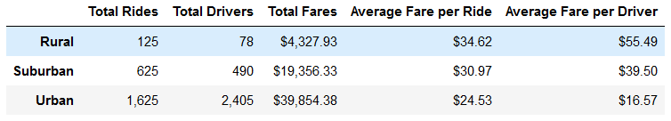
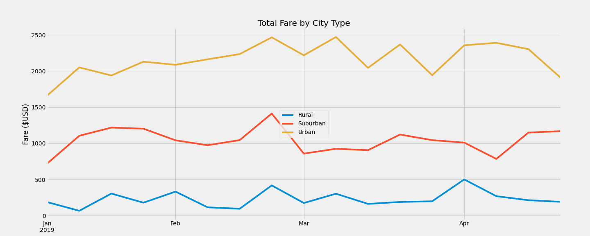

# PyBer_Analysis

## Overview

### Purpose

We will create a data frame that summarizes the ride-sharing data according to the type of city. We will then create a graph to show our results. V.isualize will be able to use this to make changes if necessary to primove Pyber.

## Results

### Data Frame Summary

After merging the dataframes we can see that Urban and Suburban cities have significantly more rides than Rural cities. Rural cities had 125 rides, Suburban cities had 625 rides, and Urban cities had 1625 rides. The number of rides roughly reflect the the total number of drivers and total fare. There is a negative correaltion when concerning the fares per ride. Rural fare's were the most here at $34.62 for an average per ride.

 ### Analysis

For all city types, we can see that the total fares are lowest at the beginning of the year and there is a peak in the last week of February.

## Summary

### Recomendations

1. Rural cities make the most fare per ride and driver, but there are not as many rides. The CEO should make efforts to increase rides in rural cities.
2. The begining of the year yields the lowest number of fares. More advertising could be used during this time of the year to increase the total number of rides and fare made.
3. Increase number of drivers in suburban and rural cities. The CEO could push incentives to hire more drivers. Urban cities bring in the most fare and one major difference is the number of drivers compared to the total number of rides. Suburban and rural cities maybe losing out on total fares due to the inavailabilty of drivers.
